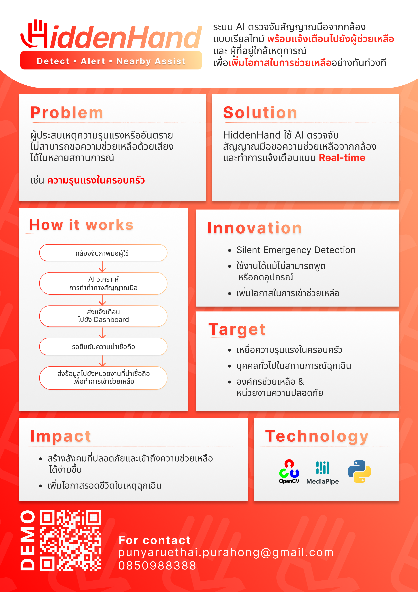

# SOS Hand Signal Detection

A distress-signal detection system that uses MediaPipe hand tracking and machine learning to recognize SOS hand gestures in real time, paired with a backend alerting system to notify when a distress signal is detected.

   

🏆 **Top 10 Finalist** — AI & Robotics Hackathon and Competitions 2025: Visionaries Pitching

## Overview

This project detects a recognized SOS hand signal from a camera feed and triggers an alert when it's identified, aiming to provide a non-verbal, camera-based way to signal distress. It combines computer vision, a trained ML model, and a backend service for logging and alerting.

## Project Poster



## How It Works

1. **Hand detection** — MediaPipe Hands tracks hand landmarks from the camera feed.
2. **Signal classification** — A machine learning model (trained on a custom dataset) classifies hand landmark patterns to recognize the SOS gesture.
3. **Face detection** — supplementary face detection to support identification/context around the alert.
4. **Alerting** — when a distress signal is detected, the system sends data to a FastAPI backend, which checks/logs the event to a database and can notify relevant parties.
5. **Web interface** — static frontend (HTML/CSS/JS) for displaying alerts or system status.

## Tech Stack

| Layer | Tool |
|---|---|
| Hand tracking | MediaPipe Hands |
| Computer vision | OpenCV |
| ML classification | Custom-trained model (see `ML_test/`) |
| Backend / API | FastAPI |
| Data storage | Database (see `check_database.py`) |
| Frontend | HTML, CSS, JavaScript (`static/`) |

## Project Structure

```
├── ML_test/              # Model training/testing scripts
├── dataset/               # Training dataset for gesture classification
├── facedetection/          # Face detection module
├── handdetection/          # Hand detection module (MediaPipe)
├── project/                # Core project logic
├── static/                 # Frontend assets (HTML/CSS/JS)
├── main.py                 # Main entry point
├── fastapi_test.py         # FastAPI backend/API
├── check_database.py       # Database check/logging utility
├── test_connection.py      # Connection testing script
├── test_sending_data.py    # Script for testing data transmission
└── readme.md
```

## Getting Started

```bash
pip install -r requirements.txt   # if available, otherwise install opencv-python, mediapipe, fastapi manually
python main.py
```

To run the API backend separately:

```bash
python fastapi_test.py
```

## Topics

`python` · `opencv` · `opencv-python` · `mediapipe` · `mediapipe-hands`

## Notes

This project was built to explore combining computer vision and machine learning for a real-world safety/alerting use case, extending an earlier vending-machine gesture-detection project into a distress-signal recognition system.
